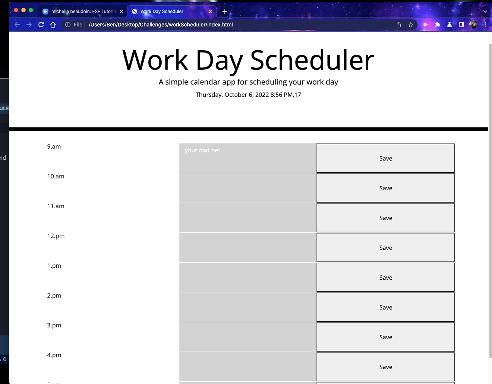

# workScheduler
#this project was made to help you keep track of your day.
this project has the ability to show you what time of day has passed, what the current hour is, and what hours are still to come, by color coding.
this site has the ability to take in your hourly events and store them in the local storage, and save it on the page when refreshed.

##I had help from a tutor and another student.
jquery and moment was used to make this project functional and effective.

readme.md 

https://mfarrell23.github.io/workScheduler/